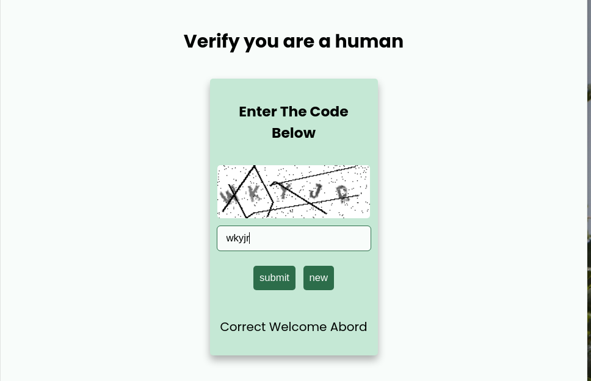

# Simple CAPTCHA From Scratch
A simple project to play with `Pillow` an image manipulation library
by generating a random code, then drawing it using `Pillow` then adding an effects _( random opacity, rotation, noise, stetching the image, and random lines )_ to make it harder for robots to read AKA captcha

with simple Web interface using `FastAPI` to verify/generate new images.

# How to Run

1. install the packages: `pip install -r requirements.txt`
_you may need to use venv_
2. `git clone https://github.com/sohyp3/Simple-Captcha `
3. `cd Simple-Captcha`
4. `uvicorn app:app --reload`

--- 

